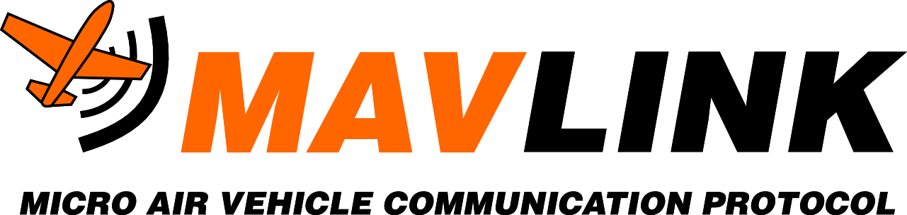

# Dron Projecte

Hem creat un codi amb Python utilitzant el Pymavlink per establir comunicacions amb sistemes de vehicles no tripulats (dron, per exemple). El nostre objectiu ha estat desenvolupar un script capaç de llegir i enviar comandes a l'autopilot, així com rebre dades de telemetria en temps real per monitoritzar el rendiment del sistema. A més, hem implementat funcions per controlar la posició, velocitat i altres paràmetres del dron de manera eficient, tot garantint la seguretat i la fiabilitat de la comunicació.

